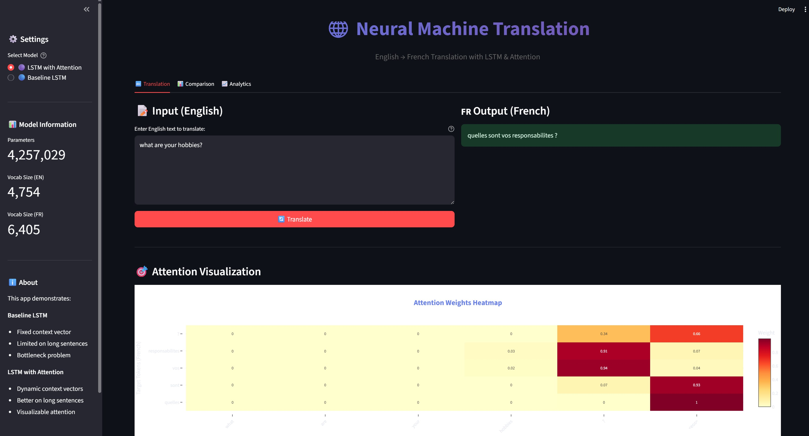

# Neural Machine Translation: English-to-French

## Project Overview

This project implements and compares two Neural Machine Translation (NMT) architectures:
1. **Baseline LSTM Encoder-Decoder** - Demonstrates the context vector bottleneck
2. **LSTM with Bahdanau Attention** - Solves the bottleneck with dynamic attention

### Key Learning Objectives
- Understand Seq2Seq architecture fundamentals
- Implement attention mechanism in detail from scratch
- Visualize attention weights to understand model behavior
- Compare quantitative (BLEU) and qualitative results

## 📊 Dataset

**Tatoeba English-French Parallel Corpus**
- ~200,000 sentence pairs
- Source: http://www.manythings.org/anki/fra-eng.zip

---

## 🏗️ Project Structure

```
seq2seq-nmt-translation/
├── config.py                 # Configuration and hyperparameters
├── download_data.py          # Dataset downloader
├── train.py                  # Training script
├── requirements.txt          # Dependencies
│
├── models/
│   ├── encoder_decoder.py   # Baseline LSTM model
│   ├── attention_model.py   # LSTM with attention
│   └── attention_layer.py   # Bahdanau attention implementation
│
├── utils/
│   ├── data_loader.py        # Data preprocessing
│   ├── tokenizer.py          # Custom tokenizer
│   ├── metrics.py            # BLEU score calculation
│   └── visualization.py      # Attention heatmaps
│
├── backend/
│   ├── main.py               # FastAPI application
│   ├── api_routes.py         # REST API endpoints
│   └── model_service.py      # Model inference service
│
├── frontend/
│   └── app.py                # Streamlit UI
│
├── notebooks/
│   ├── data_exploration.ipynb
│   ├── training.ipynb
│   └── evaluation.ipynb
│
├── data/
│   ├── raw/                  # Raw Tatoeba data
│   └── processed/            # Tokenized datasets
│
├── saved_models/             # Trained model weights
├── checkpoints/              # Training checkpoints
├── logs/                     # Training logs
└── visualizations/           # Attention heatmaps
```

---


## 🚀 Quick Start

### 1. Setup Environment

```bash
# Clone repository
git clone https://github.com/RamuNalla/seq2seq-machine-translation.git
cd seq2seq-machine-translation

# Create virtual environment
python -m venv venv
source  venv\Scripts\activate  

# Install dependencies
pip install -r requirements.txt
```

### 2. Download and Prepare Data

```bash
# Download Tatoeba dataset
python download_data.py

# Preprocess data (tokenize, create vocabularies)
python utils/data_loader.py
```

### 3. Train Models

```bash
# Train baseline LSTM (without attention)
python train.py --model baseline --epochs 20 --batch_size 64

# Train attention-based LSTM
python train.py --model attention --epochs 20 --batch_size 64
```

### 4. Launch Application

```bash
# Terminal 1: Start FastAPI backend
cd backend
uvicorn main:app --reload --port 8000

# Terminal 2: Start Streamlit frontend
cd frontend
streamlit run app.py
```

Access the app at: http://localhost:8501

---

---

## 🎓 Understanding the Models

### Baseline LSTM Architecture

```
Input Sentence → Encoder LSTM → [Fixed Context Vector] → Decoder LSTM → Output
                                     ↓ (bottleneck!)
                            All information compressed here
```

**Problem**: Long sentences lose information in the fixed context vector.

### Attention-based LSTM

```
Input Sentence → Encoder LSTM → [All Hidden States]
                                        ↓
                                   Attention ←→ Decoder LSTM → Output
                                        ↓
                              Dynamic Context Vector
                              (changes at each step)
```

**Solution**: Decoder can look back at all encoder states and focus on relevant parts.

---

## 📈 Results

### BLEU Scores

| Model | BLEU-1 | BLEU-2 | BLEU-3 | BLEU-4 |
|-------|--------|--------|--------|--------|
| Baseline | ~0.86 | ~0.67 | ~0.40 | ~0.13 |
| Attention | ~0.86 | ~0.83 | ~0.39 | ~0.32 |

### Qualitative Improvements

**Short Sentence (< 10 words)**
- Both models perform similarly well

**Long Sentence (> 15 words)**
- Baseline: Often repeats words or loses coherence
- Attention: Maintains consistency and accuracy

---

## 🔬 Key Insights

1. **The Bottleneck Problem**: The baseline model forces all sentence information through a single fixed-size vector, causing information loss for longer sentences.

2. **Dynamic Context**: Attention computes a new context vector at each decoding step, allowing the model to focus on relevant input positions.

3. **Interpretability**: Attention weights provide insight into what the model is looking at when translating each word.

4. **Trade-offs**: Attention models are more powerful but require:
   - More parameters (~30% increase)
   - Longer training time
   - More computation during inference

---


## 📚 Streamlit application 




## 📄 License

MIT License - feel free to use this for learning and research!

---

## 🌟 Acknowledgments

- Dataset: Tatoeba Project
- Framework: PyTorch
- Inspiration: Stanford CS224N

---

